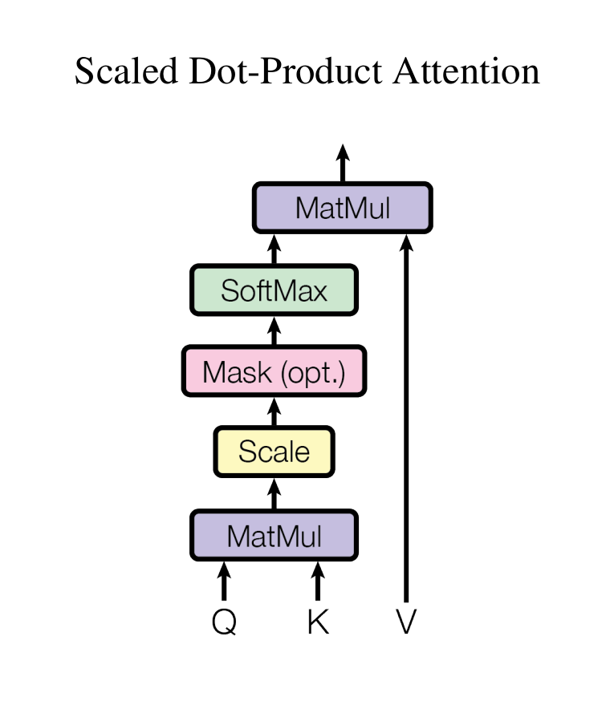

# Transformer:truck:

### Positional Encoding

**Transformer**不存在类似**RNN**的递归或者前向计算过程，因此为了表示数据的位置信息，我们需要给位置进行编码。这里，**Transformer**直接在**词向量(input embedding)**上面算术地加上**位置编码**，编码方式如下：

$$PE_{(pos,2i)}=sin(pos/10000^{2i/d_{model}})$$

$$PE_{(pos,2i+1)}=cos(pos/10000^{2i/d_{model}})$$

其中，$pos$是词在句中的位置，$i$是编码的维度，$d_{model}$是**词向量**的维度。

代码如下：

~~~python
class PositionalEncoding(NN.Module):
    """ 位置编码 """
    def __init__(self, d_model, max_len=50000):
        """
        Param
        -----
        :d_model 词向量的维度
        :max_len 句子的最大长度
        """
        super(PositionalEncoding, self).__init__()
        assert d_model % 2 == 0
        pos_enc = torch.zeros(max_len, d_model)
        # (max_len, d_model)
        pos = torch.arange(0, max_len, 1).unsqueeze(1)
        # (max_len, 1)
        div_term = 1 / torch.pow(10000.0, torch.arange(0, d_model, 2) / d_model)
        # (d_model/2)
        pos_enc[:, 0::2] = torch.sin(pos * div_term)
        pos_enc[:, 1::2] = torch.cos(pos * div_term)
        pos_enc = pos_enc.unsqueeze(0)
        self.register_buffer('pos_enc', pos_enc)
        # (1, max_len, d_model)
    
    def forward(self, X:torch.tensor):
        """
        Param
        -----
        :X [batch_size, length, d_model]
        
        Return
        ------
        :X [batch_size, length, d_model]
        """
        X =  X + Variable(self.pos_enc[:, 0:X.shape[1]], requires_grad=False)
        return X
~~~

### Attention

**注意力**可以被描述为：将**查询向量(query)**作用于**(mapping)键值向量对(key-value pair)**得到一个输出。其输出是**值向量(value)**的**权重和(weighted sum)**，而该权重又是**查询向量(query)**与其对应的**键向量(key)**的计算结果。

### Scaled Dot-Product Attention

其输入是维度为$d_k$的**查询向量**和**键向量**，以及维度为$d_v$的**值向量**，计算公式如下：

$$Attention(Q,K,V)=\mathbb{softmax}(\frac{QK^T}{\sqrt{d_k}})V$$

常用的**注意力机制**有**加性注意力(additive attention)**和**乘性注意力(dot-product attention)**。这里在**乘性注意力**的基础上增加了一个**放缩因子(scaling factor)**，即$\frac{1}{\sqrt{d_k}}$。**乘性注意力**在实践中更快、更节约空间。

~~~python
def attention(query, key, value, mask=None, dropout=None):
    """
    注意力机制
    Param
    -----
    :query (batch_size, seq_len, d_k)
    :key (batch_size, seq_len, d_k)
    :value (batch_size, seq_len, d_v)
    :mask (batch_size, seq_len, seq_len)
    :dropout function

    Return
    ------
    :output (batch_size, seq_len, d_v)
    :p_attn (batch_size, seq_len, d_k)
    """
    d_k = query.shape[-1]
    score = torch.matmul(query, key.transpose(-2, -1)) / math.sqrt(d_k)
    # (batch_size, seq_len, seq_len)
    if mask is not None:
        score = score.masked_fill(mask, -100)
    p_attn = F.softmax(score, dim=-1)
    if dropout is not None:
        p_attn = dropout(p_attn)
    return torch.matmul(p_attn, value), p_attn
~~~

### Multi-Head Attention

### Multi-Head Attention

